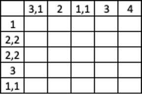
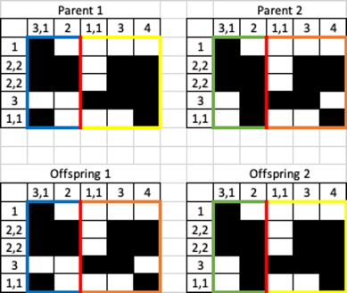

# Nonogram crossover

### Team members:
Omri Ben Akoune - 205858822  
Gal Levy - 206055527 

--------
## Overview:
The project solves the nonogram problem using Evolutionary Algorithm. 

#### Game rules:
A nonogram is a type of puzzle that consists of a grid of squares that need to be filled in with black or white colors.  
The goal is to use the clues provided to determine which squares should be filled in and which should be left blank, so that a hidden image is revealed.   
The clues are provided in the form of numbers that are located on the top of the columns and on the left side of the rows.   
These numbers indicate how many consecutive squares in that row or column should be filled in.  
For example, if the top of a column has the number "3," that means that there are three consecutive squares in that column that need to be filled in.  
Solving a nonogram requires logical thinking and a methodical approach to determine the correct placement of the colored squares.

#### Problem definition:
We would like to find a solution to a given nonogram, using the clues given to us.

#### Sample space:
All the possible binary metrics which gives a valid solution to the row clues.  
For example, for a certain row, which it's clues are [2,3] for a row in size of 8 these are the possible options:

  
We choose one row representation randomly, and do it for every row.

#### A good solution definition:
A good solution is a binary metrics which fills all the nonogram constrains. Some nonograms have more than one solution.

_____
## Implementation Details
#### Reading Input
After reading the nonogram from the nonograms_clues JSON (Each object defined with two properties row_clues and col_clues).  
We call to the main function that try to solve the nonogram using Evolutionary Algorithm. 
And in the end of the run we will get a picture of the solved nonogram.  

#### Fitness
For evaluating if solution is a good solution, we need to check that the metrix we have fulfilled the nonogram clues we got as an input. 
In the way we create individual we assure it will follow all the row constraints,   
Therefor, when evaluating how good individual is, we need to check if it fulfills the nonogram column clues. 
Our fitness function sums the number of "hits" in every column.

For example, consider the following nonogram:

  
The number of hits we have in this nonogram is 26, because there are 26 clauses in all the columns together.

#### Population and Crossover
We try to solve a max problem, because our target is to get the fitness value to it maximum value by using `Better_Is_Higer= true`  
Our population contains 200 individuals as described in the Sample Space section.  

For two individuals we create new individual by the NonogramCrossover.  
We choose a random crossover point between 1 to N , where N is the size of the column in the nonogram.  
We will take from the first parent from column 0 til the crossover point and the rest from the other parent.  
And te second child will be the rest of parent 1 and parent 2.
For example,Consider the following Nonogram: 

  

And for the following two possible parents and crossover in index 3 we will get: 

 

### Running Nonogram Solver
Our main class is responsible for running the solver.  
For each nonogram that is in the nonograms json,  
we will run 5 experiments with the same configuration expect of the random seed.  

Experiment Configuration:
* N = size of the Nonogram
* POP_SIZE = N * 10 
* MAX_GEN = 200  

Moreover, each experiment is saved in our statics and in the end of the run,  
we show graphs of average fitness and best fitness for each experiment and the shows best Nonogram solution.