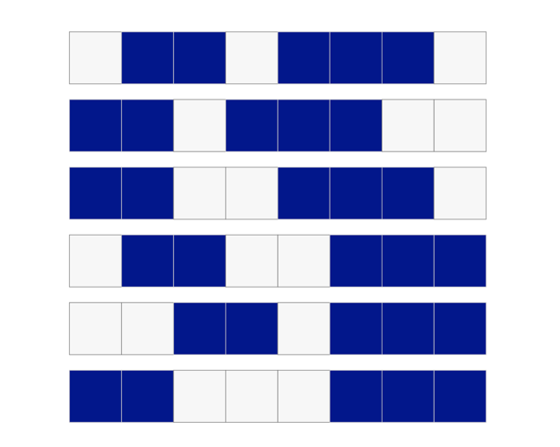
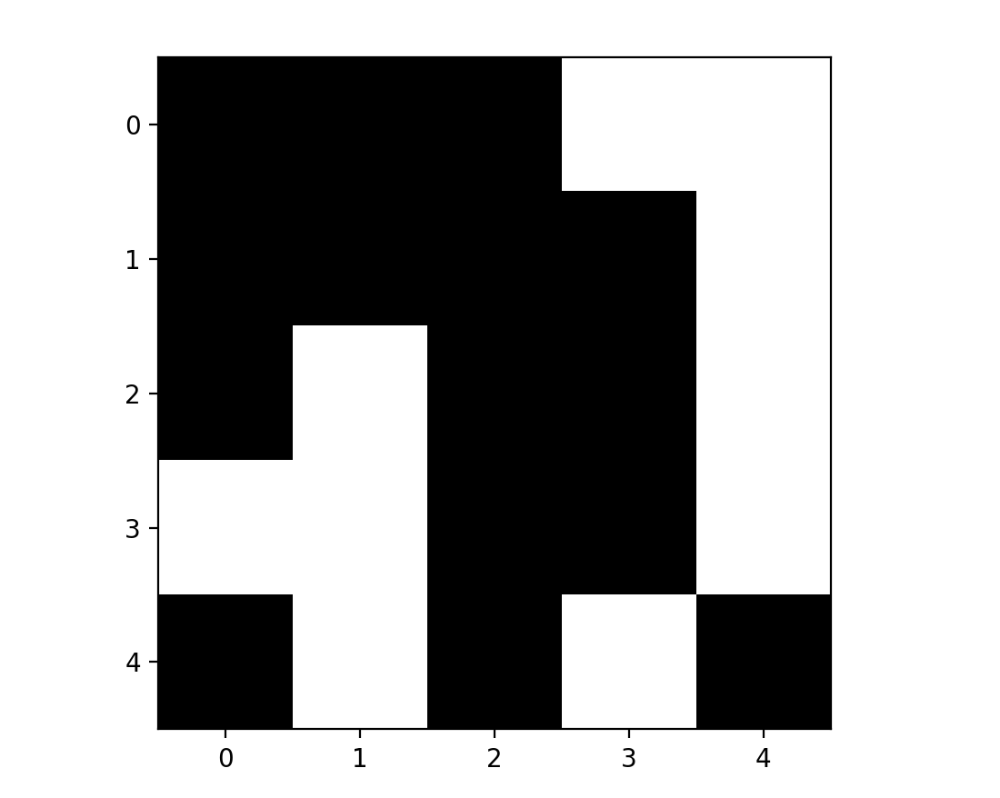
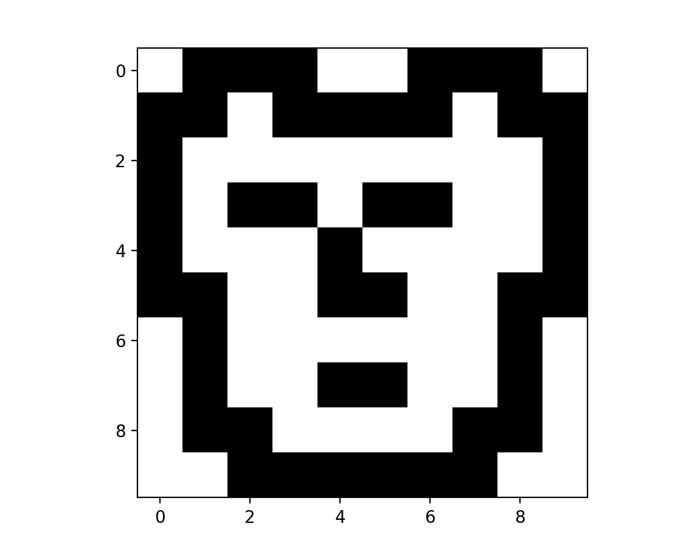
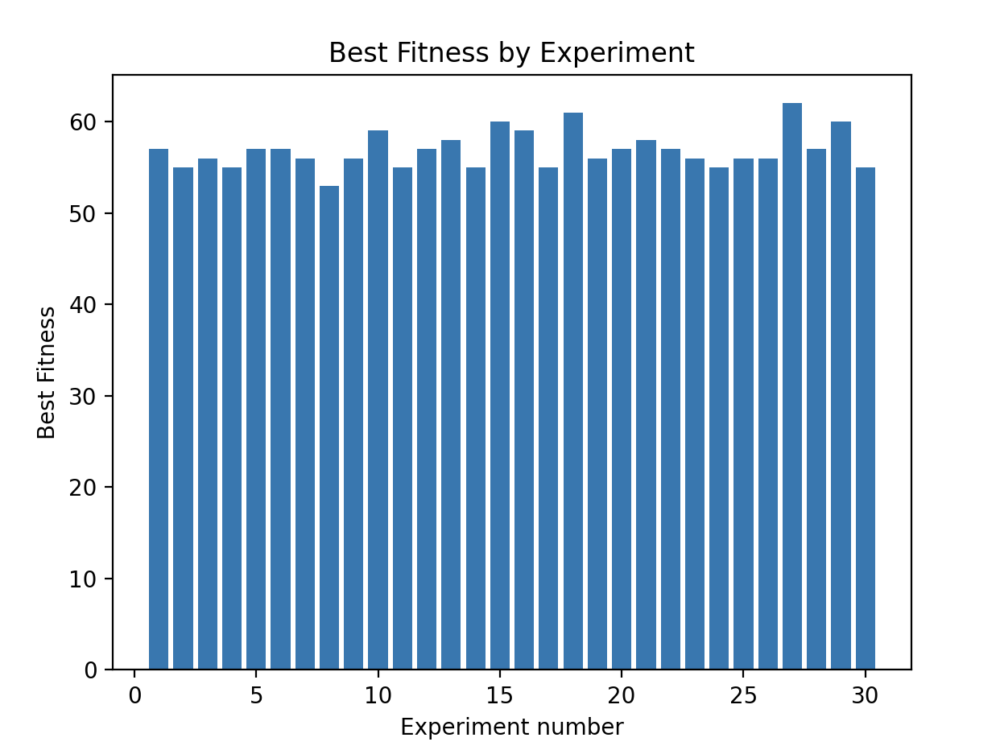
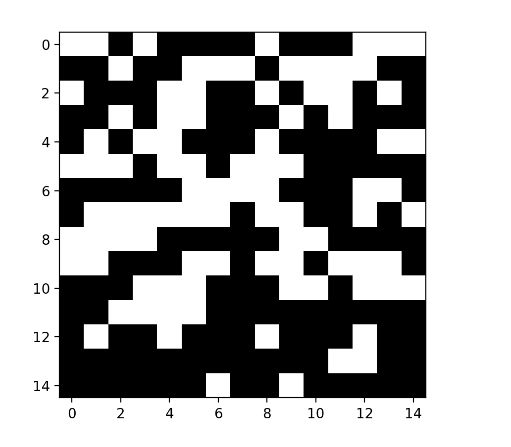

# Nonogram crossover

### Team members:
Omri Ben Akoune - 205858822  
Gal Levy - 206055527 

--------
## Overview:
The project solves the nonogram problem using Evolutionary Algorithm. 

#### Game rules:
A nonogram is a type of puzzle that consists of a grid of squares that need to be filled in with black or white colors.  
The goal is to use the clues provided to determine which squares should be filled in and which should be left blank so that a hidden image is revealed.   
The clues are provided in the form of numbers that are located on the top of the columns and the left side of the rows.   
These numbers indicate how many consecutive squares in that row or column should be filled in.  
For example, if the top of a column has the number "3," that means that there are three consecutive squares in that column that need to be filled in.  
Solving a nonogram requires logical thinking and a methodical approach to determine the correct placement of the colored squares.

#### Problem definition:
We would like to find a solution to a given nonogram, using the clues given to us.

#### Sample space:
All the possible binary metrics which gives a valid solution to the row clues.  
For example, for a certain row, which it's clues are [2,3] for a row in size of 8 these are the possible options:

  
We choose one row representation randomly, and do it for every row.

#### A good solution definition:
A good solution is binary metrics which fill all the nonogram constraints. Some nonograms have more than one solution.
_____
## Implementation Details
#### Reading Input
After reading the nonogram from the nonograms_clues JSON (Each object is defined with two properties row_clues and col_clues).  
We call to the main function that tries to solve the nonogram using Evolutionary Algorithm. 
And at the end of the run, we will get a picture of the solved nonogram.  

#### Fitness
For evaluating if the solution is a good solution, we need to check that the matrix we have fulfilled the nonogram clues we got as an input. 
In the way we create individual, we assure it will follow all the row constraints,   
Therefore, when evaluating how good an individual is, we need to check if it fulfills the nonogram column clues. 
Our fitness function sums the number of "hits" in every column.

For example, consider the following nonogram:

  
The number of possible hits we have in this nonogram is 26, because there are 26 clauses in all the columns together.

#### Population and Crossover
We try to solve a max problem because our target is to get the fitness value to its maximum value by using `Better_Is_Higer= true`  
Our population contains 200 individuals as described in the Sample Space section.  

For two individuals we create new two individuals by the NonogramCrossover.  
We choose a random crossover point between 1 to N, where N is the size of the column in the nonogram.  
We will take from the first parent from column 0 til the crossover point and the rest from the other parent.  
And the second child will be the rest of parent 1 and parent 2.
For example, Consider the following Nonogram: 

  

And for the following two possible parents and crossover in index 3 we will get: 

 

### Running Nonogram Solver
Our main class is responsible for running the solver.  
For each nonogram that is in the nonograms JSON,  
we will run 5 experiments with the same configuration except for the random seed.  

Experiment Configuration:
* N = Best fitness possible 
* POP_SIZE = `N^2`
* MAX_GEN = 200

Moreover, each experiment is saved in our statics, and in the end of the run,  
we show graphs of average fitness and best fitness for each experiment and the shows best Nonogram solution.

# Statistics

In order to test and evaluate our algorithm, we checked the results over 3 nonograms in different sizes: 
`5X5` `10X10` `15X15`

To summarize, we saw a direct connection between the nonogram's size and the population size,  
meaning as the nonogram's size increased, we needed a bigger population to solve the problem.  
In contrast, the number of generations had a smaller effect on how fast we reached the solution.  
In most the cases, at some generation, the individuals turned up to be very similar and "got stuck", meaning  
their fitness didn't improve. We tried to find a way to choose the best population size -  
not too big, but also a size that will give us a solution with the maximal fitness value.
After a few tests, we found that the perfect population size is approximately
the squared value of the number of clues.   
For example, for a nonogram with 20 clues, the approximate size of the population should be ~ 20^2 = 400.   

### Small size nonogram (5X5) results:
In this case, the maximum fitness value is 6. 
We ran 30 different experiments, to see how often we reach the perfect fitness.   
The average of the best fitness value over 30 experiments is 5.6.    
  

We tested how fast we reach the solution over different sizes of population:  
Population size = 10:   
  
 

Population size = 40 (ensured we will get the best possible fitness value):   
  
 

Considering this problem is pretty small, there was no need of more than 2-3 generations. 
 The final solution:   
  

### Mid size nonogram (10X10) results:
In this case, the maximum fitness value is 26. 
We ran 30 different experiments, to see how often we reached the perfect fitness.   
The average of the best fitness value over 30 experiments is 22.8.    
  

We tested how fast we reached the solution over different sizes of population:  
Population size = 200:   
  
 

Population size = 1000:   
  
 

It's easy to see that in both cases the solution is reached in around 25-30 generations,  
but the fitness in the second case is much higher.  
The final solution:   
  

### Large size nonogram (15X15) results:
We ran 30 different experiments, to see how often we reached the perfect fitness.   
The average of the best fitness value over 30 experiments is 56.8.    
  

We tested how fast we reached the solution over different sizes of population:  

Population size = 1000:   
  
 

Population size = 3500:   
  
 

The final solution:   
  

