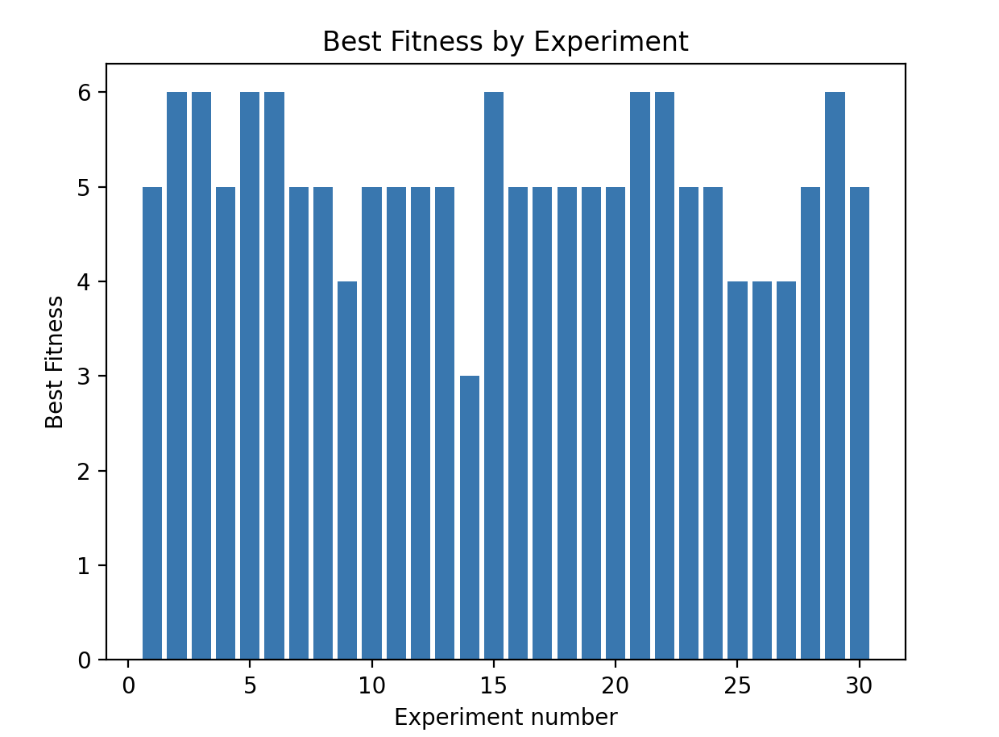
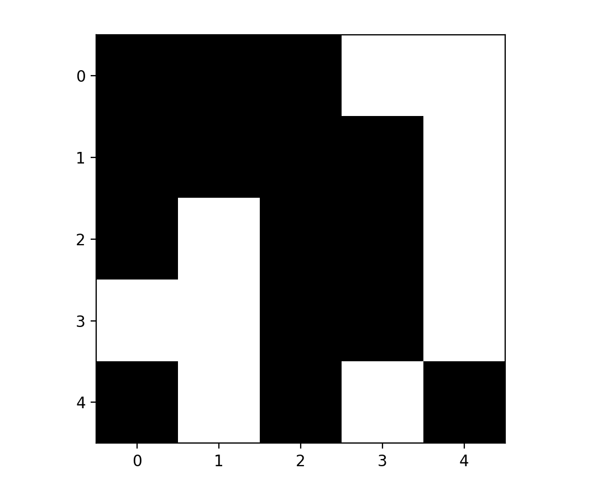
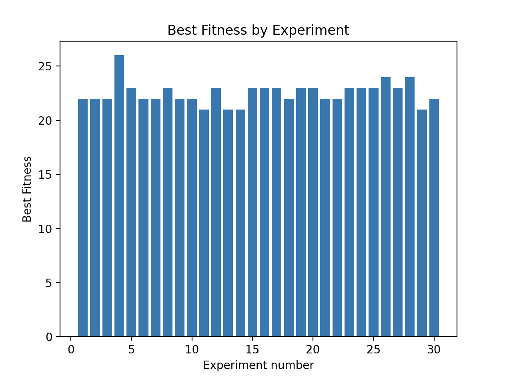
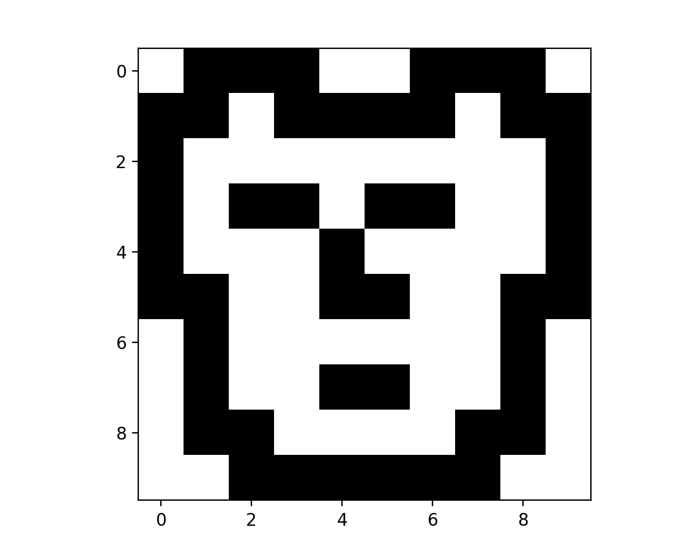
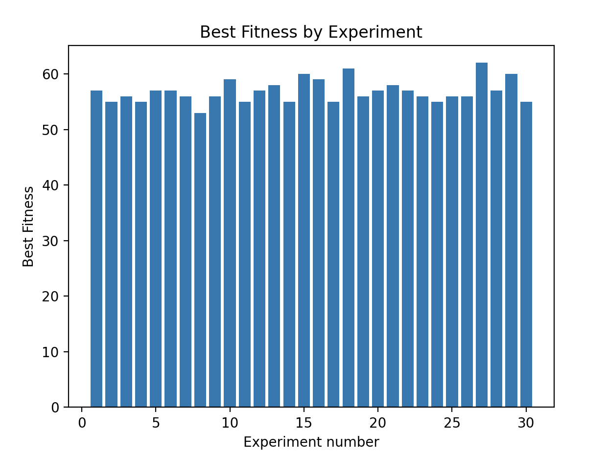
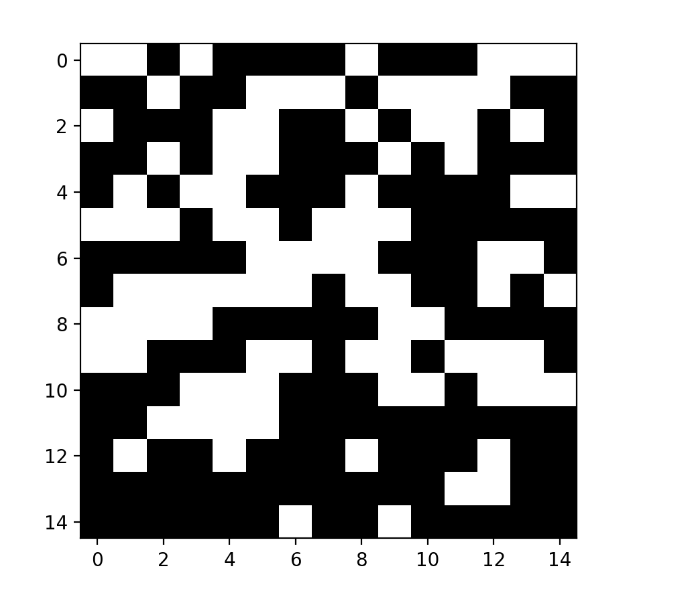

# Statistics

In order to test and evaluate our algorithm, we checked the results over 3 nonograms in different sizes: 
`5X5` `10X10` `15X15`

To summarize, we saw a direct connection between the nonogram's size and the population size,  
meaning as the nonogram's size increased, we needed a bigger population to solve the problem.  
In contrast, the number of generations had a smaller effect on how fast we reached the solution.  
In most of the cases, at some generation the individuals turned up to be very similar and "got stuck", meaning  
their fitness didn't improve. We tried to find a way to choose the best population size -  
not to big, but also a size which will give us a solution with the maximal fitness value.
After a few tests, we found that the perfect population size, is approximately
the squared value of the number of clues.   
For example, for a nonogram with 20 clues, the approximate size of population should be ~ 20^2 = 400.   

### Small size nonogram (5X5) results:
In this case, the maximum fitness value is 6. 
We ran 30 different experiments, to see how often we reach the perfect fitness.   
The average of the best fitness value over 30 experiments is 5.6.    
  

We tested how fast we reach the solution over different sizes of population:  
Population size = 10:   
  
 

Population size = 40 (ensured we will get the best possible fitness value):   
  
 

Considering this problem is pretty small, there was no need of more than 2-3 generations. 
 The final solution:   
  

### Mid size nonogram (10X10) results:
In this case, the maximum fitness value is 26. 
We ran 30 different experiments, to see how often we reached the perfect fitness.   
The average of the best fitness value over 30 experiments is 22.8.    
  

We tested how fast we reached the solution over different sizes of population:  
Population size = 200:   
  
 

Population size = 1000:   
  
 

It's easy to see that in both cases the solution is reached in around 25-30 generations,  
but the fitness in the second case is much higher.  
The final solution:   
  

### Large size nonogram (15X15) results:
We ran 30 different experiments, to see how often we reached the perfect fitness.   
The average of the best fitness value over 30 experiments is 56.8.    
  

We tested how fast we reached the solution over different sizes of population:  

Population size = 1000:   
  
 

Population size = 3500:   
  
 

The final solution:   
  

